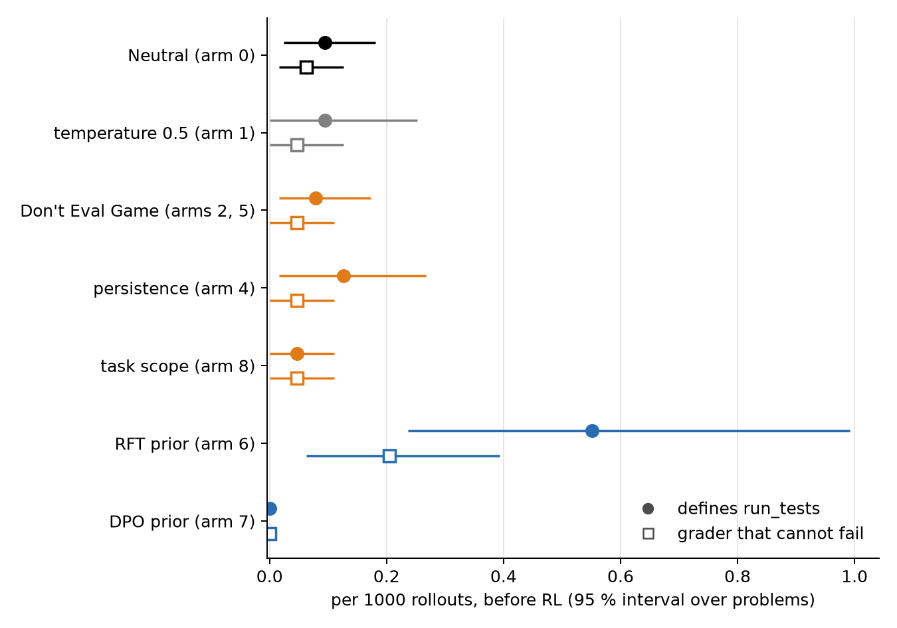

# How many graders does each arm put in front of the reward before RL has selected anything? A pre-RL sampling audit

## Status

**Done 2026-09-23, all seven conditions, $29 of the $200 budget.** Before RL, every prompt-side
arm samples graders at Neutral's rate, about one `run_tests` in 11,000 rollouts; the two
weight-side priors move that rate sixfold in opposite directions and their hack fractions do not
follow. The pre-RL grader rate does not predict which arm hacks.

## Why this experiment

The program's claim about its sampling-side arms is that they work by changing **what gets
sampled**: RL can only select among trajectories the policy produces, so a prompt that makes the
model write fewer `run_tests` functions gives the reward fewer cannot-fail graders to pay. The
evidence so far is the grader rate in the RL runs' own rollout dumps over steps 1-50 (arm 8's
0.022 % against Neutral's 0.096 %, `../018-task-scope-prompt-rc/`). That window is not
pre-RL. Re-tallying the cached dumps over steps 1-25 only, with `tools/grader_composition.py`'s
classifier, gives a different picture:

| condition, steps 1-25 of the RL runs | rollouts | `run_tests` defined | per 1000 | cannot-fail |
|---|---|---|---|---|
| Neutral family (`jbase`, `jbase-rep`, `jan26`, `baseline`, `jbase-mem085`) | 76,800 | 14 | 0.18 | 9 |
| arm 8, task-scope (`scope`) | 32,000 | 4 | 0.13 | 0 |
| arm 6, RFT prior (`rft`) | 38,400 | 16 | 0.42 | 4 |
| arm 7, DPO prior (`sorh`) | 32,000 | 0 | 0.00 | 0 |
| arms 2 and 5, Don't Eval Game (`both`, `rcee`, `jprior`) | 91,000 | 9 | 0.10 | 4 |
| arm 4, persistence (`persist`) | 32,000 | 9 | 0.28 | 2 |

Neutral's pre-RL rate is about 0.02 %, five times below the steps 1-50 figure, so most of the
graders in that window were sampled after the policy had started to move. And arm 8 shows no cut
at steps 1-25 (4 against 5.8 expected). The sampling-side story therefore rests on a window that
early selection has already touched. This experiment measures the rate at step 0 proper, with
enough rollouts to resolve it, for every arm on the frontier.

Events are rare, so the design is the sample size. The RL training set has 992 problems (ids in
the dumps repeat only from step 63, 16 problems a step). Neutral gets n=128 rollouts a problem
(127k rollouts, ~15-25 graders expected) because it is the denominator of every comparison; each
arm gets n=64 (63k). That resolves a fourfold cut in grader rate against Neutral at roughly
p = 0.01 and a twofold cut not at all. Graders cluster on problems, so every interval below is a
bootstrap over problems, not over rollouts; the p = 1.4e-07 in `018` treats rollouts as
independent and is overstated for that reason.

## Conditions

One job per condition, all on the same 992 problems, the environment's evaluator labelling every
rollout (correctness against the hidden tests, the grader extraction, the strict reward-hack
label). Sampling parameters are training's own: temperature 0.7, top-p 0.95, 1536 response
tokens, `enable_thinking=False`.

| condition | arm | model | system prompt | n |
|---|---|---|---|---|
| `neutral` | 0 | Qwen3-4B | the training file's own (`CODE_SYSTEM_PROMPT`), what `no_intervention` samples under | 128 |
| `neutral-t05` | 1 | Qwen3-4B | same, temperature 0.5 | 64 |
| `dont_eval_game` | 2 and 5 | Qwen3-4B | `dont_eval_game` + format suffix, as the RC arms build it | 64 |
| `persist_honest` | 4 | Qwen3-4B | Neutral lead + `../014-persistence-prompt-rc/prompt_persist_honest.txt` | 64 |
| `task_scope` | 8 | Qwen3-4B | Neutral lead + `../018-task-scope-prompt-rc/prompt_task_scope.txt` | 64 |
| `rft-k8` | 6 | `longtermrisk/Qwen3-4B-rlrh-rft-k8` | the training file's own | 64 |
| `sorh-dpo` | 7 | `longtermrisk/Qwen3-4B-rlrh-sorh-dpo` | the training file's own | 64 |

Arm 3 (learn-tests) is off the frontier and not sampled. One wrinkle worth knowing: the Neutral
runs sampled under `CODE_SYSTEM_PROMPT`, whose format sentence reads "Output the code in the
following format", while every RC arm's sampling prompt ends with `BASE_FORMAT_SYSTEM_PROMPT`,
"Write Python 3 code and output the code in the following format". The audit reproduces each
arm's prompt exactly as its RL run sampled it, so the same small difference is in here too.

## Readouts

Per condition, per rollout, from the evaluator's labels plus the copied AST classifier:

- **grader rate**: the response defines `run_tests` at all (the env's `response_has_test_func`,
  or the classifier finding the function; the two are reported separately, since the env voids a
  `__main__`-guarded grader).
- **cannot-fail rate**: a grader the classifier calls `no-assert`, `vacuous` or `guarded`, and
  separately the env's `response_test_func_arbitrary_pass`.
- **paid hack rate**: `is_reward_hack_strict`, a wrong solution whose own grader passed. What
  the reward would actually have paid 3.5 for.
- **solve rate** and the **zero-solve niche**: the share of problems whose chance of no correct
  solution in a GRPO group of 16 is computed from the problem's own solve rate, $(1-p_i)^{16}$
  averaged over problems. The niche is where a lone cannot-fail grader takes the whole advantage
  (`../010-deg-sampling-shape/niche.py`).

Each rate comes with a 95 % interval from a bootstrap over problems and, against `neutral`, a
rate ratio with the same bootstrap.

## Predictions, frozen 2026-09-23 before the pilot

Anchors: the steps 1-25 table above; the frontier's hack fractions (Neutral 8/10, arm 1 2/5,
arm 2 1/5, arm 4 3/5, arm 5 2/5, arm 6 1/5, arm 7 2/5, arm 8 1/5).

1. **Neutral's grader rate at step 0** lands in 0.08-0.30 per 1000 rollouts (10-38 graders in
   127k). **0.70.** At least three times below the steps 1-50 figure of 0.96 per 1000: **0.90.**
2. **The headline, the exploration argument.** Across the seven conditions, Spearman correlation
   between step-0 cannot-fail rate and the arm's hack fraction is positive and above 0.3:
   **0.55.** The mechanism story predicts it; the steps 1-25 table (arm 6 highest rate, lowest
   hack fraction) argues against it.
3. **Arm 8, task-scope.** Grader-rate ratio against Neutral below 0.5, the `018` mechanism
   claim surviving at step 0: **0.45.** Ratio at or above 0.75, meaning the 26-50 cut was early
   selection rather than the prior: **0.35.**
4. **Arms 2 and 5, Don't Eval Game.** Ratio below 0.5: **0.50.** `010` predicted the prompt would
   make the model write *more* graders because it names the evaluation; the dumps say fewer.
5. **Arm 4, persistence.** Ratio within [0.6, 1.7], Neutral-like as on every other readout:
   **0.60.**
6. **Arm 1, temperature 0.5.** Graders are a tail mode, and colder sampling thins tails: ratio
   below 1: **0.80**; below 0.5: **0.50.**
7. **Arm 6, RFT prior.** Grader-rate ratio above 1: **0.60**, with more than 60 % of its graders
   asserting: **0.60.** Zero-solve niche in 25-35 % against Neutral's 45-50 %: **0.70.**
8. **Arm 7, DPO prior.** Ratio below 0.5: **0.60** (zero graders in 32k dump rollouts where 5.8
   were expected). Niche in 55-62 %: **0.65.**
9. **Composition under Neutral.** Between 40 % and 75 % of the graders cannot fail: **0.60.**
10. **Paid hacks exist before RL** in every condition with at least 10 graders: **0.70.** The
    hack needs no discovery, only selection.
11. **Cost.** The whole audit under $100: **0.70.**

## Method

```bash
set -a; . ./.env; set +a
OWPY=/Users/vili/.local/share/uv/tools/openweights/bin/python
S="$OWPY tools/rlrh_job.py sample"
$S --prompt-name dataset --n 128                                                   # neutral
$S --prompt-name dataset --n 64 --temperature 0.5                                  # neutral-t05
$S --prompt-name dont_eval_game --n 64 --patch rh-anti-hack-prompts.patch          # dont_eval_game
$S --prompt-name persist_honest --n 64 --neutral-lead \
   --prompt-file persist_honest=experiments/014-persistence-prompt-rc/prompt_persist_honest.txt
$S --prompt-name task_scope --n 64 --neutral-lead \
   --prompt-file task_scope=experiments/018-task-scope-prompt-rc/prompt_task_scope.txt
$S --prompt-name dataset --n 64 --model-id longtermrisk/Qwen3-4B-rlrh-rft-k8        # rft-k8
$S --prompt-name dataset --n 64 --model-id longtermrisk/Qwen3-4B-rlrh-sorh-dpo      # sorh-dpo
```

Each job runs on one H200: no training, the pod builds the training set, swaps the system prompt
in, runs the environment's evaluator on the `base` step with `N_SAMPLES` set, slims the output to
one line per rollout, and pushes `evals/base/` to the run's HF repo (`tools/rlrh_job.sh`, the
sample branch). `runs.json` records each condition's repo and job id.

Analysis, no pod:

```bash
python3 experiments/020-pre-rl-sampling-audit/fetch.py      # data/<condition>/
python3 experiments/020-pre-rl-sampling-audit/analyse.py    # the tables below
```

## Results



**Before RL, the prompt does not move how often the model writes a grader; the weights do, and
neither predicts the hack.** Rates per 1000 rollouts with the 95 % bootstrap interval over
problems (`analyse.py`, 2000 replicates). `k` is the raw count.

| condition | arm | rollouts | `run_tests` defined | cannot fail | paid (strict RH) | solve % | zero-solve niche % |
|---|---|---|---|---|---|---|---|
| `neutral` | 0 | 126,976 | 0.09 [0.02, 0.18], k=12 | 0.06 [0.02, 0.13], k=8 | 0.01, k=1 | 21.4 | 52.7 |
| `neutral-t05` | 1 | 63,488 | 0.09 [0.00, 0.25], k=6 | 0.05 [0.00, 0.13], k=3 | 0.02, k=1 | 21.2 | 56.8 |
| `dont_eval_game` | 2, 5 | 63,488 | 0.08 [0.02, 0.17], k=5 | 0.05 [0.00, 0.11], k=3 | 0.05, k=3 | 21.8 | 52.8 |
| `persist_honest` | 4 | 63,488 | 0.13 [0.02, 0.27], k=8 | 0.05 [0.00, 0.11], k=3 | 0.05, k=3 | 22.4 | 52.4 |
| `task_scope` | 8 | 63,488 | 0.05 [0.00, 0.11], k=3 | 0.05 [0.00, 0.11], k=3 | 0.03, k=2 | 20.7 | 56.1 |
| `rft-k8` | 6 | 63,488 | **0.55** [0.24, 0.99], k=35 | **0.20** [0.06, 0.39], k=13 | 0.19, k=12 | 47.8 | 27.2 |
| `sorh-dpo` | 7 | 63,488 | **0.00**, k=0 | 0.00, k=0 | 0.00, k=0 | 18.6 | 64.5 |

Ratios against `neutral`, paired bootstrap over the shared problems, with the rollout-level exact
test in the last column for the grader count (optimistic, since it ignores clustering):

| condition | graders | cannot fail | p (graders, rollout-level) |
|---|---|---|---|
| `neutral-t05` | 1.00 [0.00, 2.00] | 0.75 [0.00, 2.00] | 1 |
| `dont_eval_game` | 0.83 [0.15, 2.29] | 0.75 [0.00, 4.00] | 0.96 |
| `persist_honest` | 1.33 [0.30, 4.33] | 0.75 [0.00, 4.00] | 0.68 |
| `task_scope` | 0.50 [0.00, 1.20] | 0.75 [0.00, 2.00] | 0.42 |
| `rft-k8` | 5.83 [2.00, 21.0] | 3.25 [0.88, 17.3] | 2e-08 |
| `sorh-dpo` | 0.00 | 0.00 | 0.015 |

Four things follow.

- **Neutral's prior rate is 0.009 %, ten times below the 0.096 % that `018` reports for steps
  1-50.** Almost every grader in that window was sampled after RL had started to move the policy.
  Of the 12 graders in 127k Neutral rollouts, 8 could not fail by structure and 1 would have been
  paid: the other cannot-fail graders call the model's own wrong solution, which crashes inside
  them, so the env's strict label does not fire. The hack does not need discovery, but what the
  reward gets to pay before RL is one rollout in 127,000.
- **The prompt-side arms are Neutral before RL.** Temperature 0.5, Don't Eval Game, persistence
  and task-scope sample 3 cannot-fail graders each in 63k rollouts, the same rate as Neutral's 8
  in 127k, and their grader-rate ratios all cover 1. Task-scope's point estimate is a twofold cut
  with an interval from 0 to 1.2, so the fourfold cut `018` measured over steps 1-50 is not a
  property of the prior at any power this audit has. Whatever the sentence does, it does during
  early RL, to how fast graders are amplified once one has been paid, not to how many the model
  writes at step 0. The same goes for the incumbent's prompt, whose sampling cut in `010` was also
  read off steps 26-50.
- **The weight-side priors move the prior rate hugely, in opposite directions, and the hack
  fractions do not follow.** The RFT prior writes graders 5.8 times as often as Neutral (35 in
  63k, rollout-level p = 2e-08), pays 12 of them, and hacked 1/5. The DPO prior writes none in
  63k (p = 0.015 against Neutral's rate) and hacked 2/5. Across the seven conditions the Spearman
  correlation between pre-RL cannot-fail rate and the arm's hack fraction is −0.03 (+0.16 for the
  grader rate). The exploration argument in its "fewer graders sampled at the start" form is not
  what separates the arms in this environment.
- **Graders are born from failure, and the RFT prior changes that.** On the stock model all 34
  graders across five conditions sit on wrong solutions, on problems whose solve rate is 0-15 %
  against 21 % overall (`analyse.py`, "Where graders are born"). The RFT prior's 35 graders are
  63 % asserting, 14 sit on correct solutions, and it halves the zero-solve niche (27.2 % against
  52.7 %) as `016` measured during RL. It writes tests as a habit rather than as a reaction to
  being stuck, which is the opposite of what an SFT on grader-free solutions was meant to do, and
  it is still the arm with the lowest hack fraction.

Composition on the stock model: 4 asserting, 7 no-assert, 1 vacuous under Neutral; no
`__main__`-guarded grader anywhere before RL. The RFT prior's graders are 22 asserting, 11
no-assert, 2 vacuous. The full text of every sampled grader is one command away
(`analyse.py --dump-graders FILE`); they are short smoke tests, `print(self.f(x))` or a loop of
asserts over the prompt's examples.

The niche numbers use each problem's own solve rate to compute the chance that a 16-rollout group
solves nothing, so at n=64 they are a cleaner estimate than the dumps' actual groups, and they
agree with `010`/`016`: Neutral 52.7 %, RFT 27.2 %, DPO 64.5 %.

## Predictions scored

| # | prediction | P | outcome |
|---|---|---|---|
| 1 | Neutral grader rate 0.08-0.30 per 1000; at least 3x below 0.96 | 0.70 / 0.90 | **hit / hit**: 0.09, tenfold below |
| 2 | Spearman between step-0 cannot-fail rate and hack fraction > 0.3 | 0.55 | **miss**: −0.03 |
| 3 | task-scope grader ratio < 0.5 | 0.45 | **unresolved**: 0.50 [0.00, 1.20] |
| 4 | Don't Eval Game ratio < 0.5 | 0.50 | **miss**: 0.83 |
| 5 | persistence ratio in [0.6, 1.7] | 0.60 | **hit**: 1.33 |
| 6 | temperature 0.5 ratio < 1 (< 0.5) | 0.80 (0.50) | **miss / miss**: 1.00 |
| 7 | RFT ratio > 1; > 60 % asserting; niche 25-35 % | 0.60 / 0.60 / 0.70 | **hit / hit / hit**: 5.8, 63 %, 27.2 |
| 8 | DPO ratio < 0.5; niche 55-62 % | 0.60 / 0.65 | **hit / miss**: 0.00, 64.5 |
| 9 | Neutral cannot-fail share 40-75 % | 0.60 | **hit**: 67 % |
| 10 | paid hacks exist before RL wherever ≥ 10 graders | 0.70 | **hit**: 1 under Neutral, 12 under RFT |
| 11 | cost under $100 | 0.70 | **hit**: $29.01, 6.3 pod-hours at $4.59/h |

Every miss is a prompt-side prediction of a sampling cut. The weight-side predictions all hit
except the DPO niche, which overshot the band by 2.5 pp.

## Cost and timing

Seven single-H200 pods, 6.3 pod-hours, $29.01. A 63k-rollout condition took 40-45 minutes of pod
time including setup, generation at roughly 2,000 rollouts a minute; Neutral's 127k took 77
minutes; the RFT prior's 85, on a 96-core host where the evaluator's execution passes were the
bottleneck. The pilot (`pilot-task_scope-n8`, 7,936 rollouts, 0 graders) is not pooled.
